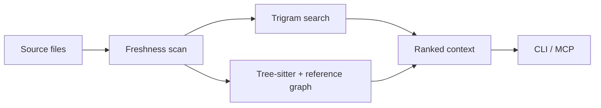

<div align="center">

# CodeIntel

**English** · [Português (Brasil)](README.pt-BR.md)

### Find the right code. Understand the impact. Make the change.

Local code intelligence for developers and coding agents.<br>
Built in Rust · Available through CLI and MCP · No API keys required

[](CHANGELOG.md) [](https://github.com/felipetruman/codeintel/actions/workflows/verify.yml) [](docs/verification/2026-09-09-v0.6.0.md) [](LICENSE)

[Get started](#get-started) · [Connect your agent](#connect-your-agent) · [See the evidence](#tested-not-just-described) · [Documentation](#documentation)

</div>

---

CodeIntel turns a repository into searchable text, structured symbols, and a
reference graph. Ask for the files relevant to a task, inspect a function's
callers, or check what a change could affect—without an inference service,
embeddings, or a vector database.

## What you gain

| When you need to… | CodeIntel gives you… |
| --- | --- |
| Explore unfamiliar code | A ranked set of files to inspect first. |
| Locate an implementation | Literal and regex matches verified against source text. |
| Plan a change | Definitions, callers, callees, and transitive impact. |
| Keep working after edits | Automatic index refresh with reuse of unchanged files. |

**Structural languages:** Rust, Python, JavaScript / JSX, and TypeScript / TSX.
Lexical search also works on other eligible text files.

## Get started

Requires Git, Cargo with Rust edition 2024 support, and a C compiler.

```sh
git clone https://github.com/felipetruman/codeintel.git
cd codeintel
cargo install --path . --locked
codeintel --version
```

Keep Cargo's binary directory, normally `$HOME/.cargo/bin`, on `PATH`.
Then explore this repository:

```sh
# Find the files relevant to a task
codeintel context "understand repository architecture" . --limit 5

# Locate a function and inspect its relationships
codeintel search 'resolve_root' . --limit 10
codeintel symbol resolve_root .

# Check the impact before editing
codeintel impact resolve_root . --depth 2
```

For another project, replace `.` with its path and `resolve_root` with one of
its symbols. Retrieval commands return JSON.

> **No indexing ceremony.** Queries create or refresh `.codeintel/`
> automatically. The repository must be writable; add `.codeintel/` to its
> `.gitignore`. A background daemon is optional.

## Connect your agent

Add a stdio server entry to your MCP client's configuration:

```json
{
  "command": "/absolute/path/to/codeintel",
  "args": ["mcp", "/absolute/path/to/your/repository"]
}
```

Replace both paths and use your client's configuration wrapper. An explicit
repository path keeps the server independent of the client's working directory.

| MCP tool | Use it to… |
| --- | --- |
| `code_context` | Discover files relevant to a task. |
| `code_search` | Find literal or regex matches. |
| `code_symbol` | Inspect definitions, callers, callees, and references. |
| `code_impact` | Inspect direct callers and transitive blast radius. |

All four tools refresh indexes automatically. Keep native tools such as `rg`
available as a fallback. [MCP and path resolution →](docs/reference.md#mcp)

## How it works



The lexical and structural indexes are independent. Unchanged files reuse
cached work; changed files are reindexed and reparsed. Context ranking combines
text matches, symbols, graph importance, and proximity. State stays in the
repository's `.codeintel/` directory.

**Know the boundaries:** resolution is conservative, not compiler-grade type
analysis. Dynamic or unresolved calls can be absent from the graph. Edits that
preserve both size and modification time can evade the freshness check.
[Architecture and limitations →](docs/reference.md#reference-resolution-policy)

## Tested, not just described

Verification for **v0.6.0 · September 9, 2026**:

| Suite | Result |
| --- | --- |
| Rust runtime | **59 passed** |
| CLI + MCP integration | **17 passed** — all 10 commands and 4 tools exercised |
| Agent benchmark | **116 passed**, 2 real-agent tests intentionally skipped |
| Deterministic matrix | **16 successful results** — 8 rg + 8 CodeIntel |

These are dated results; the CI badge above shows the current `main` workflow.
[Full verification record →](docs/verification/2026-09-09-v0.6.0.md)

The functional proof uses `submit_order → checkout → process_payment`:
search finds the expected files, impact identifies `checkout` as the direct
caller, and changing one file reuses the other two. Run both proofs locally:

```sh
cargo build --release --locked
python3 docs/verification/prove_core.py
python3 docs/verification/prove_interfaces.py
```

Python 3.11+ is required for the interface proof. These checks use the real
binary and temporary repositories; they make no model calls.

**Measure your own workload.** The [benchmark matrix](benchmarks/agent/README.md)
provides deterministic rg/CodeIntel comparisons and opt-in Claude/Codex A/B
runners. Real agents require explicit permission and Linux Bubblewrap
containment. No token-savings or agent-speedup percentage is claimed.

## Documentation

| Start here | What you will find |
| --- | --- |
| [CLI and architecture reference](docs/reference.md) | Commands, persistent state, freshness, diagnostics, and limitations. |
| [Benchmark guide](benchmarks/agent/README.md) | Setup, synthetic tasks, runners, metrics, and reports. |
| [Verification record](docs/verification/2026-09-09-v0.6.0.md) | Test scope, observed results, and reproduction. |
| [Changelog](CHANGELOG.md) | What changed in v0.6.0. |
| [Development instructions](AGENTS.md) | Architecture and engineering conventions. |

<details>
<summary><strong>Run the development checks</strong></summary>

```sh
cargo fmt --check
cargo test --locked
cargo clippy --locked --all-targets --all-features -- -D warnings
cargo build --release --locked
python3 docs/verification/prove_interfaces.py
git diff --check
```

The [CI workflow](.github/workflows/verify.yml) also runs the offline benchmark
suite and deterministic matrix. See the benchmark guide for Python dependencies.

</details>

---

[Apache-2.0](LICENSE) · Local indexing and retrieval. No external inference required.
