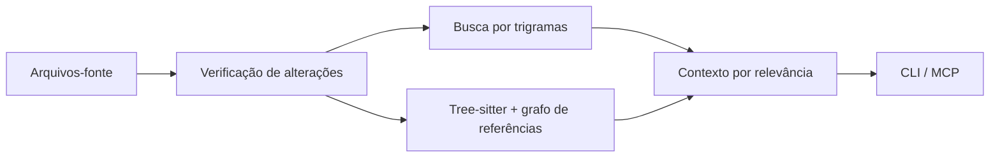

<div align="center">

# CodeIntel

[English](README.md) · **Português (Brasil)**

### Encontre o código certo. Entenda o impacto. Faça a alteração.

Inteligência de código local para desenvolvedores e agentes de programação.<br>
Feito em Rust · Disponível via CLI e MCP · Sem necessidade de chaves de API

[](CHANGELOG.md) [](https://github.com/felipetruman/codeintel/actions/workflows/verify.yml) [](docs/verification/2026-09-09-v0.6.0.md) [](LICENSE)

[Comece aqui](#comece-aqui) · [Conecte seu agente](#conecte-seu-agente) · [Confira as evidências](#testado-na-prática) · [Documentação](#documentação)

</div>

---

O CodeIntel transforma um repositório em texto pesquisável, símbolos estruturados
e um grafo de referências. Encontre os arquivos relevantes para uma tarefa,
inspecione quem chama uma função ou descubra o que uma alteração pode afetar.
Tudo isso sem serviço de inferência, embeddings ou banco de dados vetorial.

## O que você ganha

| Quando você precisa… | O CodeIntel oferece… |
| --- | --- |
| Explorar um código desconhecido | Arquivos ordenados por relevância para começar a análise. |
| Localizar uma implementação | Correspondências literais e por regex verificadas no código-fonte. |
| Planejar uma alteração | Definições, funções chamadoras, funções chamadas e impacto transitivo. |
| Continuar trabalhando após editar | Atualização automática dos índices, reutilizando arquivos sem alterações. |

**Linguagens com análise estrutural:** Rust, Python, JavaScript / JSX e
TypeScript / TSX. A busca textual também funciona em outros arquivos de texto
aceitos pelo indexador.

## Comece aqui

Requer Git, Cargo com suporte à edição 2024 do Rust e um compilador C.

```sh
git clone https://github.com/felipetruman/codeintel.git
cd codeintel
cargo install --path . --locked
codeintel --version
```

Mantenha o diretório de executáveis do Cargo, normalmente `$HOME/.cargo/bin`,
no `PATH`. Em seguida, explore este repositório:

```sh
# Encontre os arquivos relevantes para uma tarefa
codeintel context "understand repository architecture" . --limit 5

# Localize uma função e inspecione suas relações
codeintel search 'resolve_root' . --limit 10
codeintel symbol resolve_root .

# Confira o impacto antes de editar
codeintel impact resolve_root . --depth 2
```

Para outro projeto, substitua `.` pelo caminho do repositório e `resolve_root`
por um dos seus símbolos. Os comandos de consulta retornam JSON. O texto da
consulta de exemplo foi mantido em inglês para corresponder ao código do projeto.

> **Sem indexação manual prévia.** As consultas criam ou atualizam `.codeintel/`
> automaticamente. O repositório precisa permitir escrita; adicione `.codeintel/`
> ao seu `.gitignore`. Executar um serviço em segundo plano é opcional.

## Conecte seu agente

Adicione uma entrada de servidor stdio à configuração do seu cliente MCP:

```json
{
  "command": "/caminho/absoluto/para/codeintel",
  "args": ["mcp", "/caminho/absoluto/para/seu/repositorio"]
}
```

Substitua os dois caminhos e insira essa entrada no formato de configuração do
seu cliente. Um caminho explícito para o repositório evita depender do diretório
em que o cliente foi iniciado.

| Ferramenta MCP | Use para… |
| --- | --- |
| `code_context` | Descobrir arquivos relevantes para uma tarefa. |
| `code_search` | Encontrar correspondências literais ou por regex. |
| `code_symbol` | Inspecionar definições, funções chamadoras, funções chamadas e referências. |
| `code_impact` | Inspecionar quem chama um símbolo diretamente e o alcance do impacto transitivo. |

As quatro ferramentas atualizam os índices automaticamente. Mantenha ferramentas
nativas, como `rg`, disponíveis como alternativa.
[MCP e resolução de caminhos →](docs/reference.md#mcp)

## Como funciona



Os índices textual e estrutural são independentes. Arquivos sem alterações
reutilizam o trabalho armazenado; os modificados são reindexados e analisados
novamente. A classificação do contexto combina correspondências textuais,
símbolos, importância no grafo e proximidade. O estado fica no diretório
`.codeintel/` do repositório.

**Conheça os limites:** a resolução é conservadora e não faz análise de tipos
como um compilador. Chamadas dinâmicas ou não resolvidas podem ficar fora do
grafo. Edições que preservam tanto o tamanho quanto a data de modificação podem
não ser detectadas pela verificação de atualização.
[Arquitetura e limitações →](docs/reference.md#reference-resolution-policy)

## Testado na prática

Verificação da **v0.6.0 · 9 de setembro de 2026**:

| Suíte | Resultado |
| --- | --- |
| Runtime Rust | **59 testes passaram** |
| Integração CLI + MCP | **17 testes passaram** — todos os 10 comandos e as 4 ferramentas exercitados |
| Benchmark de agentes | **116 testes passaram**, 2 testes com agentes reais ignorados intencionalmente |
| Matriz determinística | **16 resultados bem-sucedidos** — 8 rg + 8 CodeIntel |

Esses resultados são datados; o badge de CI acima mostra o estado atual do
workflow de `main`. [Registro completo da verificação →](docs/verification/2026-09-09-v0.6.0.md)

A prova funcional usa `submit_order → checkout → process_payment`: a busca
retorna os arquivos esperados, a análise de impacto identifica `checkout` como
chamador direto e a alteração de um arquivo permite reutilizar os outros dois.
Execute as duas provas localmente:

```sh
cargo build --release --locked
python3 docs/verification/prove_core.py
python3 docs/verification/prove_interfaces.py
```

A prova das interfaces requer Python 3.11+. Essas verificações usam o executável
real e repositórios temporários; não fazem chamadas a modelos.

**Meça no seu próprio cenário.** A [matriz de benchmark](benchmarks/agent/README.md)
oferece comparações determinísticas entre rg e CodeIntel, além de executores A/B
para Claude e Codex com ativação explícita. Agentes reais exigem permissão
explícita e isolamento com Bubblewrap no Linux. Não há alegação de percentual
de economia de tokens ou de ganho de velocidade dos agentes.

## Documentação

Os documentos de referência abaixo estão em inglês.

| Comece por aqui | O que você encontra |
| --- | --- |
| [Referência da CLI e da arquitetura](docs/reference.md) | Comandos, estado persistente, atualização dos índices, diagnóstico e limitações. |
| [Guia do benchmark](benchmarks/agent/README.md) | Configuração, tarefas sintéticas, executores, métricas e relatórios. |
| [Registro de verificação](docs/verification/2026-09-09-v0.6.0.md) | Escopo dos testes, resultados observados e reprodução. |
| [Histórico de alterações](CHANGELOG.md) | O que mudou na v0.6.0. |
| [Instruções de desenvolvimento](AGENTS.md) | Arquitetura e convenções de engenharia. |

<details>
<summary><strong>Execute as verificações de desenvolvimento</strong></summary>

```sh
cargo fmt --check
cargo test --locked
cargo clippy --locked --all-targets --all-features -- -D warnings
cargo build --release --locked
python3 docs/verification/prove_interfaces.py
git diff --check
```

O [workflow de CI](.github/workflows/verify.yml) também executa a suíte de
benchmark offline e a matriz determinística. Consulte o guia do benchmark
para instalar as dependências Python.

</details>

---

[Apache-2.0](LICENSE) · Indexação e consulta locais. Sem inferência externa obrigatória.
